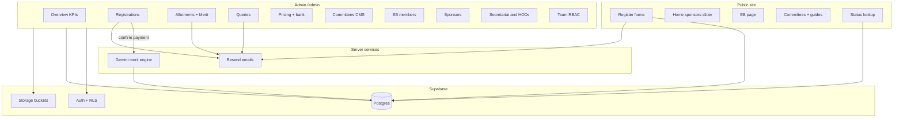
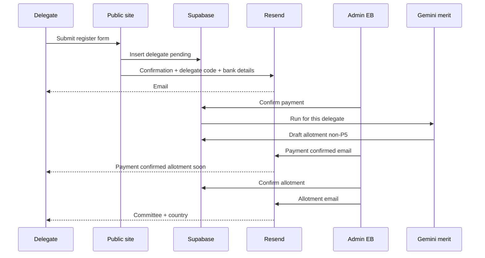

# MERITMUN III — Admin Panel Implementation Plan

Detailed plan for a Supabase-backed operations console at `/admin`, plus the public-site changes it drives (pricing, bank details, EB/HOD/Secretariat renames, sponsors slider, study guides, real registration persistence).

This document is the source of truth for implementation. Record new runtime dependencies in `context/architecture.md` **before** adding packages (see [Architecture dependency notes](#architecture-dependency-notes)).

---

## Locked decisions

| Decision | Choice |
|---|---|
| Backend | **Supabase** — Postgres, Auth, Storage, RLS |
| Next.js integration | `@supabase/supabase-js` + `@supabase/ssr` |
| P5 (never auto-allotted) | **USA, China, Russia, UK, France** (UNSC permanent members with veto). EB may assign manually. |
| Transactional email | **Resend** (server actions or Edge Function) |
| Merit engine AI | **Google Gemini** (server-side only; key in env) |
| Design | Existing brand tokens: diplomatic green + gold CTA, Eczar/Archivo, dark-default. Dense ops UI. Follow `DESIGN.md` and `context/ui-rules.md`. |

---

## Current baseline

The site is a **content + conversion** marketing app:

- No database, auth, email, CMS, or admin (`PRODUCT.md`).
- Forms validate and call `persist()` in `lib/actions.ts` (logs only).
- Domain shapes live in `lib/types.ts`.
- Public board tiers: `secretariat` | `directorate` in `content/board.ts`.
- Pricing is static in `content/site.ts` (`pricing` object).
- Registration is gated (`registrationOpen = false`).

The admin panel turns the documented seams into a real ops stack without abandoning the `app → components → lib → content` layering rule.

---

## Goals

1. Give EB a complete console: registrations, payments, allotments, queries, pricing, content, team.
2. Persist every registration and drive status lookup from real data.
3. Run a **merit engine** on payment confirm that assigns countries by experience, committee hardness, and agenda relevance — never auto-assigning P5.
4. Let EB override drafts and confirm allotments (emails go out only on EB confirm).
5. Make pricing, bank details, committees/guides, EB, HODs, Secretariat, and sponsors editable so the public site reflects admin changes immediately.
6. Enforce RBAC so a **Reviewer** can see delegates and nothing more sensitive to mutate.

---

## Architecture



### Route layout

```
app/admin/
  (auth)/
    login/page.tsx
  (dashboard)/
    layout.tsx          # sidebar shell; no public header/footer
    page.tsx            # Overview
    registrations/page.tsx
    allotments/page.tsx
    queries/page.tsx
    pricing/page.tsx
    committees/
      page.tsx
      [id]/page.tsx
    eb/page.tsx
    sponsors/page.tsx
    secretariat-hods/page.tsx
    team/page.tsx
```

- Middleware: protect `/admin/*` except `/admin/login`. Require Supabase session + `profiles.role` in `{ admin, eb, reviewer }`.
- Reviewer routes: allow Overview (read KPIs that do not expose bank secrets if desired), Registrations (read), Allotments (read). Redirect/deny mutations and Team/Pricing write surfaces.

### Code layout additions

| Path | Role |
|---|---|
| `lib/supabase/client.ts` | Browser client |
| `lib/supabase/server.ts` | Server Components / server actions |
| `lib/supabase/middleware.ts` | Session refresh helpers |
| `lib/merit/run.ts` | Merit engine orchestration |
| `lib/merit/p5.ts` | P5 country normalization + detection |
| `lib/merit/prompt.ts` | Gemini prompt + JSON schema |
| `lib/email/*.ts` | Resend templates + send helpers |
| `components/admin/*` | Shell, tables, drawers, KPI cards, forms |
| `supabase/migrations/*.sql` | Schema + RLS |
| `supabase/seed.sql` | Seed from current `content/*` |

Keep dependencies downward: `app → components → lib`. Components must not import Supabase service-role clients.

### Content migration strategy

1. **Phase A:** Seed DB from `content/committees.ts`, `content/board.ts`, `content/site.ts` pricing.
2. **Phase B:** Public pages read DB with a short fallback to static content if DB is empty (launch safety).
3. **Phase C:** Remove fallbacks once admin CMS is trusted; keep `content/` only for copy that is not CMS-managed (FAQ wording, etc.) or delete after cutover.

---

## Architecture dependency notes

Record these in `context/architecture.md` **before** `npm install` during implementation. Rationale must live in that file per existing project rule.

| Package / service | Why |
|---|---|
| `@supabase/supabase-js` | Official client for Postgres queries, Auth, Storage. |
| `@supabase/ssr` | Cookie-based sessions for Next.js 16 App Router (Server Components, middleware, server actions). |
| `resend` | Transactional email (registration confirm, payment, allotment, query reply). Supabase Auth handles invite mail; Resend handles product mail with branded templates. |
| `@google/generative-ai` (or current Gemini SDK) | Merit engine ranking of open portfolios by agenda relevance + hardship. Server-only; never expose the key. |

**Env vars (checklist):**

```
NEXT_PUBLIC_SUPABASE_URL=
NEXT_PUBLIC_SUPABASE_ANON_KEY=
SUPABASE_SERVICE_ROLE_KEY=
GEMINI_API_KEY=
RESEND_API_KEY=
EMAIL_FROM=MeritMUN <noreply@meritmun.org>
```

**Supabase Storage buckets:**

| Bucket | Public? | Contents |
|---|---|---|
| `study-guides` | Authenticated download / public read OK for PDFs | Committee background guides |
| `eb-photos` | Public read | EB member photos |
| `sponsor-logos` | Public read | Sponsor logos |
| `hod-photos` | Public read (optional) | HOD photos if provided |

**Also update when implementing:** `PRODUCT.md` “out of scope” list (admin + DB are now in scope), and `context/progress-tracker.md` for phases.

---

## Naming map (public site)

| Today | Target |
|---|---|
| Executive Board page section **“The Secretariat”** | **EB** (Executive Board members with photos) |
| Board tier `secretariat` | `eb` |
| **“The Directorate”** / Directors | **HODs** |
| Board tier `directorate` | `hod` |
| Committee **chairs** (Chair / Vice Chair / Director) | Labeled and managed as **Secretariat** (photo not required) |
| Nav label “Executive Board” | Keep or shorten to **EB** — prefer **EB** on marketing surfaces once content is real; route may stay `/executive-board` for URL stability |

Admin nav labels:

- EB → `/admin/eb`
- Secretariat & HODs → `/admin/secretariat-hods`

---

## Data model

All timestamps `timestamptz`. Prefer `uuid` primary keys. Use `text` enums via check constraints or Postgres enums.

### `profiles`

Extends `auth.users`.

| Column | Type | Notes |
|---|---|---|
| `id` | uuid PK | FK → `auth.users.id` |
| `email` | text | |
| `full_name` | text | |
| `role` | text | `admin` \| `eb` \| `reviewer` |
| `avatar_url` | text null | |
| `created_at` / `updated_at` | timestamptz | |

Trigger on `auth.users` insert → create profile (default role `reviewer` unless invite metadata sets role).

### `pricing_settings` (singleton)

One row (`id = 1` or fixed uuid).

| Column | Type | Notes |
|---|---|---|
| `currency` | text | default `PKR` |
| `delegate_fee` | integer | Individual delegate |
| `delegation_fee` | integer | Base / package fee if used; else 0 |
| `per_delegate_fee` | integer | Per head in a delegation |
| `delegation_min` / `delegation_max` | integer | Align with current 5–30 |
| `early_bird_enabled` | boolean | |
| `early_bird_delegate_fee` | integer null | |
| `early_bird_per_delegate_fee` | integer null | |
| `early_bird_ends_at` | timestamptz null | |
| `updated_at` | timestamptz | |
| `updated_by` | uuid null | FK profiles |

Public register and admin Pricing page read/write this row. Changes reflect immediately on the portal.

### `announcement_settings` (singleton)

One row (`id = 1`). Powers the scrolling announcement bar above the public site header.

| Column | Type | Notes |
|---|---|---|
| `is_active` | boolean | When false, the bar is hidden |
| `message` | text | Ticker copy (max 200 in the admin UI) |
| `link_type` | text | `none` \| `internal` \| `external` |
| `internal_path` | text null | Site path such as `/committees` or `/register` |
| `external_url` | text null | `http(s)` URL when `link_type = external` |
| `updated_at` | timestamptz | |
| `updated_by` | uuid null | FK profiles |

Public site SELECT when `is_active = true`. Admin + EB write from Overview. Reviewer may read.

### `bank_accounts`

| Column | Type |
|---|---|
| `id` | uuid PK |
| `bank_name` | text |
| `account_title` | text |
| `account_number` | text |
| `iban` | text null |
| `branch` | text null |
| `instructions` | text null |
| `is_active` | boolean |
| `sort_order` | int |
| `created_at` | timestamptz |

Shown on the website **after** successful registration (confirmation screen + confirmation email).

### `committees`

Mirror + extend `lib/types.ts` `Committee`.

| Column | Type | Notes |
|---|---|---|
| `id` | uuid PK | |
| `slug` | text unique | |
| `name` | text | |
| `abbr` | text | |
| `type` | text | GA / specialised / crisis / press |
| `difficulty` | text | beginner \| intermediate \| advanced |
| `hardness_score` | int | 1–10 for merit engine |
| `agenda` | text | Primary signal for Gemini relevance |
| `overview` | text | |
| `focus_points` | jsonb | string[] |
| `seats` | int | |
| `study_guide_path` | text null | Storage path |
| `study_guide_url` | text null | Public URL cache |
| `featured` | boolean | |
| `is_published` | boolean | |
| `sort_order` | int | |
| `created_at` / `updated_at` | timestamptz | |

### `portfolios`

Countries / entities assignable in a committee.

| Column | Type | Notes |
|---|---|---|
| `id` | uuid PK | |
| `committee_id` | uuid FK | |
| `country_name` | text | |
| `is_p5` | boolean | True for USA/China/Russia/UK/France (normalized) |
| `hardness` | int | 1–10 optional override |
| `notes` | text null | |
| `is_active` | boolean | |

Unique `(committee_id, country_name)`. On insert/update, set `is_p5` via shared normalizer (`lib/merit/p5.ts`): match aliases (United States, USA, US, U.S.A.; UK, United Kingdom, Britain; PRC, People's Republic of China; Russian Federation; France).

### `delegates`

| Column | Type | Notes |
|---|---|---|
| `id` | uuid PK | |
| `reference` | text unique | e.g. `MMIII-XXXXXX` |
| `delegate_code` | text unique | Sent in confirmation email; used for status / support |
| `full_name` | text | |
| `email` | text | |
| `phone` | text | |
| `institution` | text | |
| `age` | int | |
| `city` | text | |
| `experience` | text | first-time \| 1-3 \| 4-9 \| 10-plus |
| `prior_awards` | text null | |
| `committee_prefs` | jsonb | ranked slug[] length 3 |
| `accommodation` | boolean | |
| `dietary` | text null | |
| `hear_about` | text | |
| `payment_status` | text | `pending` \| `confirmed` \| `rejected` |
| `payment_amount` | int null | Snapshot of fee at confirm time |
| `payment_confirmed_at` | timestamptz null | |
| `payment_rejected_at` | timestamptz null | |
| `rejection_reason` | text null | |
| `delegation_id` | uuid null | FK if part of a delegation |
| `fee_type` | text | `delegate` \| `delegation_member` \| `early_bird_*` |
| `created_at` / `updated_at` | timestamptz | |

### `delegations`

| Column | Type |
|---|---|---|
| `id` | uuid PK |
| `reference` | text unique |
| `institution_name` | text |
| `institution_city` | text |
| `institution_type` | text |
| `head_name` | text |
| `head_email` | text |
| `head_phone` | text |
| `head_role` | text |
| `delegation_size` | int |
| `faculty_accompanying` | boolean |
| `committee_spread` | jsonb |
| `accommodation_count` | int |
| `notes` | text null |
| `payment_status` | text |
| `payment_amount` | int null |
| `created_at` / `updated_at` | timestamptz |

### `delegation_members`

Optional explicit roster if collected later; until then, individual `delegates.delegation_id` links members created under a delegation registration flow.

### `allotments`

| Column | Type | Notes |
|---|---|---|
| `id` | uuid PK | |
| `delegate_id` | uuid FK | |
| `committee_id` | uuid FK | |
| `portfolio_id` | uuid FK | |
| `source` | text | `merit` \| `manual` |
| `status` | text | `draft` \| `confirmed` |
| `rationale` | text null | Gemini / EB note |
| `score` | numeric null | |
| `confirmed_at` | timestamptz null | |
| `confirmed_by` | uuid null | profiles |
| `created_at` / `updated_at` | timestamptz | |

Constraints:

- Unique active portfolio per committee: one confirmed/draft holder per `portfolio_id` (exclude soft-deleted if any).
- One primary allotment per delegate (or one per committee if multi-committee is ever allowed — **default: one allotment per delegate**).

### `eb_members`

| Column | Type |
|---|---|---|
| `id` | uuid PK |
| `name` | text |
| `role` | text |
| `bio` | text |
| `email` | text null |
| `photo_path` / `photo_url` | text null |
| `initials` | text |
| `sort_order` | int |
| `is_published` | boolean |

### `hods`

Same shape as EB; photos optional.

### `secretariat_members`

Committee chairs / Secretariat (no photo required).

| Column | Type |
|---|---|---|
| `id` | uuid PK |
| `committee_id` | uuid FK |
| `name` | text |
| `role` | text | Chair \| Vice Chair \| Director (or free text) |
| `initials` | text |
| `sort_order` | int |

### `sponsors`

| Column | Type |
|---|---|---|
| `id` | uuid PK |
| `name` | text |
| `logo_path` / `logo_url` | text |
| `url` | text | Click-through |
| `sort_order` | int |
| `is_active` | boolean |

### `queries`

| Column | Type |
|---|---|---|
| `id` | uuid PK |
| `name` | text |
| `email` | text |
| `topic` | text |
| `subject` | text |
| `message` | text |
| `status` | text | `open` \| `answered` \| `archived` |
| `reply_body` | text null |
| `replied_at` | timestamptz null |
| `replied_by` | uuid null |
| `created_at` | timestamptz |

Wire `submitContact` to insert here.

### `email_logs`

Audit: `to_email`, `template`, `related_type`, `related_id`, `provider_id`, `status`, `created_at`.

### `merit_runs` (optional but recommended)

| Column | Type |
|---|---|---|
| `id` | uuid PK |
| `delegate_id` | uuid |
| `status` | text | success \| failed \| skipped |
| `error` | text null |
| `raw_response` | jsonb null |
| `created_at` | timestamptz |

---

## RLS matrix

| Role | Delegates / Delegations | Allotments | Pricing / Bank | Content CMS | Queries | Team (`profiles`) | Announcement |
|---|---|---|---|---|---|---|---|
| **admin** | full | full | full | full | full | full | full |
| **eb** | full | full | read (optional write: **read-only** for EB) | full | full | none | full |
| **reviewer** | **SELECT only** | **SELECT only** | none | none | none | none | read |

**Locked policy for EB vs Pricing:** EB can **read** pricing for context; only **admin** edits pricing and bank accounts. EB cannot manage Team invites/roles.

Use `auth.uid()` + `profiles.role`. Service role in server actions for: payment confirm → merit run → email (bypasses RLS carefully; still check caller role in application code).

---

## Merit engine

### Module: `lib/merit/run.ts`

**Trigger:** Automatically when a delegate’s `payment_status` becomes `confirmed` (individual confirm or delegation batch confirm that marks members paid).

**Also:** Manual “Re-run merit” for draft-only allotments from Allotments page.

### Inputs

- Delegate: experience, prior awards, committee preferences.
- Preferred committee(s): honor pref order when seats remain; if pref committees are full, fall through with rationale.
- Committee: `difficulty`, `hardness_score`, `agenda`, open `portfolios`.
- Open portfolios: not already allotted (draft or confirmed), `is_active`, and **`is_p5 = false`**.

### Scoring intent

The most experienced delegates should receive countries that are **most agenda-relevant and hardest to represent** — not merely “prestigious” names. Example: for an Iran–Israel agenda, a top delegate should get a highly relevant hard portfolio, not a generic easy seat; P5 are excluded from auto-assignment even when relevant.

Pipeline:

1. Choose target committee (prefs × remaining seats × hardness).
2. Collect candidate portfolios (exclude P5 + taken).
3. Call Gemini with agenda, candidate list, delegate experience summary → JSON array `{ portfolioId, relevanceScore, hardshipScore, rationale }`.
4. Combine with local experience weight → final score; assign top unique portfolio.
5. Insert `allotments` with `source = merit`, `status = draft`, store rationale.
6. Log `merit_runs`.

### Hard rules

1. **Never** auto-assign P5 (USA, China, Russia, UK, France).
2. If Gemini fails or returns empty: **fail closed** — no allotment; flag for EB. Do **not** fall back to P5 or random easy seats.
3. Re-run replaces only **draft + source=merit** rows; never overwrite `confirmed` or `manual` without explicit EB force.
4. Same country name may appear in different committees (separate portfolio rows). Within one committee, portfolio is unique.
5. Delegation members may be assigned the **same** country in different committees or **different** countries; EB can set either in the UI.
6. EB may manually assign **including P5**, with a visible warning badge in the UI.

### Gemini contract

- Model: configurable via env (e.g. `gemini-2.0-flash`).
- Response: strict JSON only; validate with hand-written validators in `lib/validation.ts` style (no Zod unless architecture.md is updated).
- Temperature low; include agenda text and portfolio names only (no PII beyond experience band and awards summary).

---

## Email matrix

| Trigger | Template | Body essentials |
|---|---|---|
| Delegate / delegation registers | `registration-confirmation` | Thanks, **delegate code** / reference, next steps, **active bank accounts**, fee amount |
| Admin resends confirmation | same | Same payload |
| Payment confirmed | `payment-confirmed` | Payment received; allotment coming soon |
| EB confirms allotment(s) | `allotment-confirmed` | Committee, country, study guide link if any |
| Query reply | `query-reply` | Admin reply text |
| Team invite | Supabase Auth invite | Set password → `/admin/login` |

Log every send in `email_logs`. Resend failures surface in admin UI (toast + log status).

---

## Admin pages — detailed UX

Shared chrome:

- Left sidebar: Overview, Registrations, Allotments, Queries, Pricing, Committees, EB, Sponsors, Secretariat & HODs, Team (role-gated).
- Top bar: conference name, user menu, theme toggle (reuse site tokens).
- Density: compact tables, sticky filter bars, detail **drawers** for quick actions; full pages for committee portfolio editors.
- Gold (`bg-accent`) only for primary confirms (Confirm payment, Confirm allotments, Save pricing). Destructive reject uses a strong but non-gold danger token (define `--danger` if missing — document in ui-tokens when implementing).
- Loading: `Skeleton`. Empty: `EmptyState` with one clear CTA. Errors: `Alert` with recovery action.
- Mobile: stacked filters; tables scroll horizontally; sidebar collapses to drawer.
- No glassmorphism, no emoji icons, no purple gradients, no side-stripe accent borders — same bans as public site.

### 1. Overview — `/admin`

**Purpose:** Situation awareness for today’s ops.

**KPI cards (required):**

1. Total delegates  
2. Total registrations (delegates + delegations count, with secondary split)  
3. Pending payments  
4. Confirmed payments  
5. Total amount (sum of `payment_amount` for confirmed; or fee × confirmed if amount null)

**Supporting (complete page):**

- Open queries count → link to Queries.
- Recent registrations (last 10) with payment badge.
- Simple funnel: registered → pending → confirmed → allotted (draft) → allotment confirmed.
- Empty conference state: “No registrations yet” + link to open registration / copy public register URL.
- **Homepage announcement:** message, show/hide, link to an internal page (dropdown) or external URL. Writes `announcement_settings`.

Reviewer sees the same read-only KPIs (no bank account numbers on this page).

### 2. Registrations — `/admin/registrations`

**Tabs:** Delegates | Delegations.

**Delegates table columns:** Name, Email, Reference, Delegate code, Institution, Experience, Pref 1, Payment status, Registered at.

**Filters / search:** Full-text on name, email, reference, delegate code; filters for payment status, experience, institution, date range, preferred committee.

**Row / drawer actions:**

| Action | Behavior |
|---|---|
| View | Full application fields |
| Resend confirmation email | Re-sends registration template with delegate code |
| Confirm payment | Sets `confirmed`, snapshots fee, sends payment email, **runs merit engine** |
| Reject | Sets `rejected`, optional reason, optional email |

**Delegations tab:** Institution, head contact, size, payment status, member list in drawer. Confirm payment can mark delegation + all linked members and run merit **per member** (batch with progress).

Confirm/Reject gated: admin + eb only. Reviewer: view/search only.

### 3. Allotments — `/admin/allotments`

**Tabs:** Delegates | Delegations.

**Merit panel (top):**

- Last run summary, failure count.
- Button: Re-run for selected / all paid-without-confirmed-allotment (draft merit only).
- Short explanation of rules + P5 exclusion.

**Table:** Delegate, Committee, Country, Source (merit/manual), Status (draft/confirmed), Rationale excerpt, P5 badge if manual P5.

**Actions:**

- Edit allotment (committee + portfolio select; P5 allowed with warning).
- Clear draft.
- Confirm one / Confirm selected / Confirm all drafts in view → emails.
- Delegation view: assign members individually; allow same or different countries across the delegation.

Auto-run on payment is the default path; this page is for review, override, and EB publish.

### 4. Queries — `/admin/queries`

Inbox list with topic filters and status chips (open / answered / archived).

Detail: original message, reply composer, Send reply (Resend + store), Archive.

Contact form on public site inserts `queries` with `status = open`.

### 5. Pricing — `/admin/pricing`

**Fees (PKR):**

- Individual delegate fee  
- Delegation fee (if used) + **per-delegate fee** in a delegation  
- Early bird: enable toggle, early bird prices, optional end datetime  

**Live preview** of the public pricing note component using current form state.

**Bank accounts:** CRUD list; active accounts appear post-registration on public confirmation UI and in emails.

Only **admin** can save. Changes write `pricing_settings` / `bank_accounts` and are read live by register flows.

### 6. Committees — `/admin/committees`

List + create/edit:

- All public fields (name, slug, type, difficulty, hardness_score, agenda, overview, focus points, seats, featured, published).
- **Study guide** upload → Storage; replace/remove.
- Nested **Portfolios** manager: add countries, auto-flag P5, set hardness, deactivate.

Public `/committees` and `[slug]` consume published rows; study guide link uses Storage URL.

### 7. EB — `/admin/eb`

CRUD for EB members: name, role, bio, email, photo, sort order, published.

Public `/executive-board` **EB** section reads these rows (replacing old Secretariat tier content).

### 8. Sponsors — `/admin/sponsors`

CRUD: name, logo upload, click URL, sort order, active.

**Public:** Home page **sponsor logo slider** — continuous or snap carousel of active sponsors; each logo links out (`target="_blank"` relnoopener). No cards-in-hero; place **below** the first viewport (after hero composition), as its own section with one headline. Motion: gentle auto-scroll + pause on hover (2–3 intentional motions max for the section).

### 9. Secretariat & HODs — `/admin/secretariat-hods`

**Tabs:** Secretariat | HODs.

- **Secretariat:** chairs linked to committees; name, role, initials; photo **not** required.
- **HODs:** name, role, bio, optional photo, sort, published.

Public: committee detail chair list from Secretariat; board page HOD section from HODs (replacing Directorate).

### 10. Team — `/admin/team`

Admin-only.

- List profiles: name, email, role, last sign-in if available.
- Invite by email + role.
- Change role / deactivate (ban via Supabase Auth or `role` + blocklist).

**Roles:**

| Role | Access |
|---|---|
| Admin | Everything |
| EB | Ops + content; no Team; pricing read-only |
| Reviewer | Read delegates (registrations list + detail); read allotments; no mutations |

---

## Public site changes (driven by admin)

1. Rename board sections: Secretariat → **EB**, Directorate → **HODs**.
2. Label committee chairs as **Secretariat**.
3. Home sponsor slider fed by `sponsors`.
4. Post-registration bank details from `bank_accounts`.
5. Pricing note / live totals from `pricing_settings` (early bird aware).
6. Study guides from Storage.
7. `persist()` writes delegates/delegations; sends confirmation email with **delegate code**.
8. `/register/status` looks up by reference or delegate code against real rows (payment + allotment state).
9. Homepage announcement bar from `announcement_settings` (above the header).

---

## Key flows

### Registration → payment → allotment



### Manual P5 override

1. EB opens allotment drawer → selects portfolio flagged P5.  
2. UI shows warning: “P5 — veto power portfolio; merit engine never assigns this automatically.”  
3. Save as `source = manual`, `status = draft` until confirm + email.

---

## Design quality bar (definition of done per page)

A page is “complete” when:

- [ ] Primary job is obvious in under 3 seconds.
- [ ] Empty, loading, and error states are designed (not blank).
- [ ] Filters/search work for the main entity.
- [ ] Mutations have confirm dialogs where destructive or irreversible (reject, confirm allotment bulk).
- [ ] RBAC hides or disables forbidden actions (not just API 403).
- [ ] Uses design tokens only (no raw hex in TSX).
- [ ] Works on desktop and a usable mobile layout.
- [ ] Matches brand: green structure, gold sparingly, Eczar for page titles, Archivo for UI.

---

## Implementation phases

### Phase 1 — Foundation

- Create Supabase project; write migrations for all tables + RLS.
- Add Supabase clients + middleware auth.
- Admin login + shell + role gate.
- Overview with KPI queries (even if zeros).
- Record deps in `context/architecture.md`.

### Phase 2 — Registrations, email, pricing

- Replace `persist()` with real inserts + delegate codes.
- Registration admin UI (list, filters, confirm/reject, resend).
- Resend templates: registration + payment.
- Pricing + bank admin; public read + post-register display.
- Status lookup against DB.

### Phase 3 — Committees, portfolios, merit, allotments

- Committees CMS + study guide upload + portfolios + P5 flagging.
- Merit engine module + payment-confirm hook.
- Allotments UI (tabs, override, confirm + email).

### Phase 4 — Queries, people, sponsors, public renames

- Queries inbox + reply.
- EB, Secretariat & HODs CMS; public renames.
- Sponsors admin + home slider.
- Seed from `content/*`.

### Phase 5 — Team RBAC polish

- Invites, role edits, reviewer lock-down audit.
- RLS penetration check (reviewer cannot update payment_status).
- Remove static fallbacks where safe; update PRODUCT / progress tracker.

---

## Testing checklist

- [ ] Reviewer cannot confirm payment or edit allotments (UI + RLS).
- [ ] Merit never assigns USA/China/Russia/UK/France (unit test normalizer + integration with mocked Gemini returning P5 — engine must reject).
- [ ] Manual P5 assign works and emails on confirm.
- [ ] Early bird toggle changes public fee immediately.
- [ ] Bank details appear only after successful registration, not on marketing pages.
- [ ] Resend confirmation includes the same delegate code as first send.
- [ ] Delegation batch confirm runs merit per member without double-booking a portfolio.
- [ ] Study guide PDF opens from public committee page.
- [ ] Sponsor slider only shows `is_active`; click opens `url`.
- [ ] Announcement bar appears above the header when active; hidden when off; internal and external links work.
- [ ] Theme toggle works inside admin shell.

---

## Non-goals (this plan)

- Online payment gateway (JazzCash/card) — ops confirm payments manually.
- Delegate self-serve portal beyond status lookup.
- In-committee chat or crisis tools.
- Replacing Next.js or abandoning Tailwind token system.

---

## File deliverable summary

| Artifact | Status |
|---|---|
| `context/doc/admin-panel.md` | This document |
| Implementation code | Separate effort after this plan |
| `context/architecture.md` dependency rows | Apply at start of Phase 1 (notes listed above) |
`)
